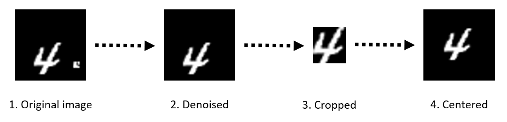

# CS420-Machine-Learning-Project

## Contents

* [Summary](#summary)
* [Prerequisite](#prerequisite)
* [Preprocessing](#preprocessing)
* [Traditional Methods](#traditional-methods)
* [CNN](#cnn)
* [Capsule](#capsule)
* [Result](#result)
* [Team Member](#team-member)

## Summary

We are faced with a classification problem on a modified MNIST handwritten digits data set ([`mnist_test/`](./mnist_test)). This data set contains 60000 training samples and 10000 testing samples. Each data sample is a 45× 45 dimensional binary image.

## Prerequisite

* Python
* Pytorch==0.4.0
* Numpy==1.14.2
* Scikit Learn==0.19.1
* tqdm==4.11.2

## Preprocessing

We preprocess the images to invert the artificial disturbance as follows:

```python
cd traditional-learning-method
python3 preprocessing.py
```



## Traditional Methods

* Enter the [traditional-learning-method/](./traditional-learning-method) folder:

  `cd traditional-learning-method`

* KNN:

  `python3 KNN.py`

* SVM:

  `python3 SVM.py`

* Ensemble method:

  `python3 voting.py`

## CNN

We try three kinds of network architectures, SimpleCNN, VGG and Resnet.

Usage:

```
	cd deep-learning-method
	python tools/train.py [--gpu GPU-ID] [--dataset DATASET] [--net NET] 
	[--resume path/to/resume/from] [--logdir path/to/log/dir]

	arguments:
	--gpu GPU-ID    		the id of GPU card to use
	--dataset DATASET  		the dataset to train and test
	--net NET     			the network structure to use
					options: ConvNet,vgg16,vgg11,res18,res34,res50,res101      
	--resume path/to/resume/from	resume training from the given path
	--logdir path/to/log/dir	directory to log 
```

## Capsule

Usage:

```
	cd capsule
	CUDA_VISIBLE_DEVICES=0 python3 capsule_network.py
```

## Result

|  Model   | Accuracy / % |         Model          | Accuracy / % |
| :------: | :----------: | :--------------------: | :----------: |
|   KNN    |    98.40     | KNN without preprocess |    88.12     |
|   SVM    |    98.75     | SVM without preprocess |    93.22     |
| Ensemble |    98.40     |                        |              |
|  VGG16 |       99.79  |  VGG16 without preprocess |    99.71     |                 
| Res101     |    99.83   |  Res101 without preprocess |    99.73    |    
|  CapsNet      | 99.80  | CapsNet without preprocess |    99.78   |   


## Team Member

* [Weichao Mao](https://github.com/xizeroplus)
* [Ruiheng Chang](https://github.com/crh19970307)


